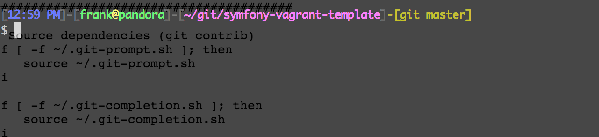
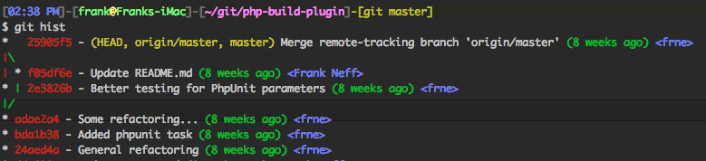

# Fancy Development Box Config

Just a few scripts and configs to make development easy again

*TOC*
- [Colorful console (Bash)](#colorful-console-bash)
- [Git Config](#git-config)
- [Notes](#notes)
- [License](#license)

## Colorful console (Bash)



### Prerequisites

Git contrib-scripts and grc

Run commands in [bash-colors/install.sh](bash-colors/install.sh)

### Usage

Copy and adapt [bash-colors/.bash_profile](bash-colors/.bash_profile)

## Git Config



There is an example git configuration for fancy colors and handy shortcuts in [git-config/.gitconfig](/git-config/.gitconfig)

## Notes

This config should work on every OS/distro with a bash console. The configuration file name is maybe ```~/.bashrc``` or ```~/.profile```.

Tested with:
- Debian Squeeze
- Debian Wheezy
- OSX 10.6
- OSX 10.7
- OSX 10.8

## License

Licensed under MIT, see [LICENSE](LICENSE)
